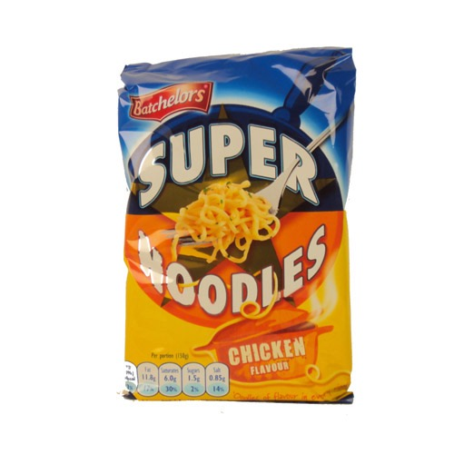

I fell in love with instant ramen when I was a kid. It was one of the first things I learnt to cook on my own and managed to get me through some tight university days, when all I could afford to eat was noodles that cost 6p (because I'd spent all my money on alcohol!). I remember looking at the recipe on the back of the packet and making the decision to try cooking them differently because I didn't like how watery they were. This goes against what ramen is, but I didn't like the soup that came with instant ramen, I wanted the concentrated flavour on the noodles only. So I experimented until I found the perfect amount of water to add to the noodles, to allow the packet's seasoning to coat each noodle for maximum flavour (for those of you that are wondering it was 100ml of water, which really isn't a lot).

Since my childhood days I've improved somewhat in my cooking. When I was 17 I worked in Duttons Winebar in Chester, as a prep chef, and then worked in The Living Room in both Chester and Liverpool, as a commis chef. When I met my wife, whilst in university, I remember cooking her a 3-course meal for the first time and being blown away by the joy she got from eating the food I'd cooked. From that point on I knew that I wanted to challenge myself to cook much more interesting dishes.

Along my culinary adventures I fell in love with Japanese cuisine. I couldn't help but be attracted to delicious sushi, which is everywhere in the world now; sashimi, pure and unadulterated fish; and ramen, the nostalgic noodle that started me on my journey into umami heaven. Japanese cuisine is an art form, which is based on the Power of Five, in short, all 5 senses should be reflected in the meal that is prepared, e.g. there should be 5 tastes: salty, sweet, bitter, sour and umami (that delicious savoury flavour found in meats and cheeses); and 5 colours: white (rice), brown (mushrooms), yellow (egg yolk), red (radish) and green (spring onions); amongst the other 3 senses as well. It's a wonderful and healthy way to live your life and I recommend everyone try it. For more in depth information checkout [The Power of Five](http://www.savoryjapan.com/learn/culture/power.of.five.html).

After Japan I moved onto other cuisines such as Vietnamese and Thai and these days I hardly cook any Japanese. However, I was recently introduced to a programme on Netflix called 'The Mind of a Chef', where the chef is a guy called David Chang, i.e. this guy:

David owns a restaurant called Momofuku and after watching how excited _he_ was getting about ramen, my nostalgic love affair with the noodle was back! So, I've decided to set myself a challenge of cooking one ramen dish a week for a whole year, blogging the recipe and my experience and understanding as much as I can about the art of ramen. I hope you enjoy my posts and learn a bit more about this complex dish.

# Soy Chicken Ramen with a 63ºC Sous-Vide Egg

## Ingredients (serves 2)

_The broth:_

* Splash of sesame oil
* 2cm piece of ginger, minced
* 1 garlic clove, minced
* 3 tbsp light soy sauce
* 2 tbsp mirin
* 1l chicken stock

_The toppings:_

* 2 chicken breasts
* 150g chestnut mushrooms, sliced
* 2 large eggs
* 1 leek, trimmed, sliced and cleaned
* 2 radishes, sliced
* 3 spring onions, sliced

_The noodles:_

* 2 Medium egg noodle slabs

## Method

1. Set the sous-vide to 63C, vac-seal the chicken and place in the water bath for 1 hour and 30 minutes.
2. Gently place the eggs in the sous-vide after 45 minutes so they cook for the remaining 45 minutes.
3. Place the sesame oil in a heavy based saucepan over a medium heat and add the garlic and ginger, leave to gently cook for a few minutes. Add the soy sauce and mirin and cook for another 5 minutes. Add the stock and bring to a gentle simmer.
4. When the chicken is ready start cooking the noodles in boiling water, add the mushrooms to the stock and put the eggs in an ice bath for 5 minutes.
5. Drain the noodles and divide between two warmed bowls. Blanch the leek and place in the noodles, to one side of the bowl, add the radish next to them, use a slotted spoon to place the mushrooms next to them, and finally, take the chicken out of the sous-vide and slice before settling in between the mushrooms and the leeks.
6. Peel the eggs and place, whole, in the centre of the dish, scatter with the Spring onions and ladle over the hot broth.
7. Serve with light soy sauce and nanami togarashi (Japanese 9-spice).

This was my first ramen in a long time and it did not disappoint! I hope you are able to try it and get as much pleasure from it as I did. If you have any questions or comments then please leave them in the comments section and I'll get back to you. Oh, and don't worry if you don't have a sous-vide as the chicken will work just as well fried, grilled or poached and the eggs will be perfectly fine boiled.

SC.