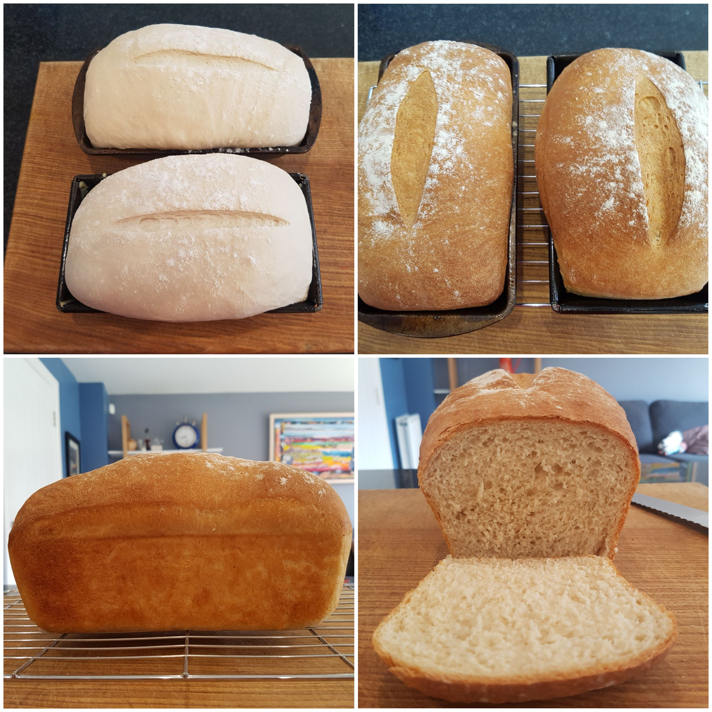

To me white bread conjures up two specific treats: one is a deliciously soft bacon butty with thick smoked back bacon and tomato ketchup; the other is a single slice smeared with a thick layer of salted butter and then half a row of chip shop chips (drenched in salt and vinegar) and then folded over to accompany some crispy fish and chips with mushy peas. White bread is a treat... and such a wonderfully moreish treat it is. Of course, you can buy perfectly good white bread from the supermarket but there is nothing better than freshly baked bread. So for this post I will be reviewing recipes from four famous chefs: Paul Hollywood, Delia Smith, Dominic Chapman and Jamie Oliver; experimenting with ingredients to see the effects it has on the end result and defining my perfect white loaf based on my findings. So if you love white bread and want a recipe that explains what it is that makes it the best recipe, rather than just giving you a recipe then this is the place to come to. 

## Paul Hollywood's Basic White Tin Bread

First up is the dreamy-eyed Paul Hollywood and his basic white tin bread, which is found in his [How To Bake](https://www.amazon.co.uk/How-Bake-Paul-Hollywood/dp/140881949X/ref=sr_1_1_twi_har_2?ie=UTF8&qid=1527192202&sr=8-1&keywords=how+to+bake&dpID=51kRnw%252BT5xL&preST=_SX218_BO1,204,203,200_QL40_&dpSrc=srch) book. 

__NOTE:// Replace with the affiliate link here for Amazon__

In this book, Paul suggests using instant yeast as he believes there is little difference made to the quality of the bread when compared to using fresh yeast. However, he does stress that it is pivitol that you get the temperature of the water right for making your dough, which he suggests is 15ºC, which is fairly cool to the touch. 

> __Top Tip From Paul Hollywood__
>
> When adding water to yeast, colder water will produce slow-rising doughs, which have more flavour because as yeast feeds on flour it releases alcohol and this flavours the bread. Using warm water to activate the yeast will cause the bread to rise rapidly and have less flavour.

He also recommends using some unsalted butter to help the bread stay soft for longer, which may be important if you are making the bread for the week; and table salt to help flavour the bread and improve the gluten structure. The last ingredient he uses is olive oil for helping with kneading (which is not an issue for people with a stand mixer) and for greasing the loaf tin. 

He then leaves it to rise at 20-22ºC until it's doubled in size, which is roughly 1-2 hours. He does stress that the dough doubling in size is the key point here so don't take it out too soon. Once the dough has been knocked-back he then leaves the bread to prove in a loaf tin wrapped in a bag, for about an hour, until the dough is at least doubled in size and springs back quickly if prodded lightly. 

Finally, he slashes the top of the dough, dusts lightly with flour and bakes in the oven with a roasting tray filled with boiling water, to create a steamy atmosphere that will help give a crisp, light crust and slight sheen. 

### Verdict

The first thing to note about this bread was the look, it was relatively uniform which means the pockets of air have all risen equally, which makes a good loaf for making sandwiches from. When cutting into the bread the centre proved that point with small air pockets, this was due to the short gluten that had formed, most likely due to the butter in the dough. This also made the bread incredibly soft, which made it perfect for a fresh sandwich but interestingly not a packed lunch - I added tomatoes to my sandwich and even within the 10 minutes it took me to eat the sandwich, the tomato juice had already started to seep into the bread and make it slightly soggy, something that would not be appealing left in the fridge for lunch at work but freshly made is incredible. The last thing to say about this bread is how light and crispy the texture of the crust was, there was a beautiful crunch without any toughness. Unfortunately, the bread was not entirely simple to get out of the loaf tin when cooked, luckily I had a silicon mat on the base so I could pry away the sides with a knife, but it wasn't as easy as I was hoping for. All in all, this loaf has definitely set the bar high for the other challengers in this post.

## Delia Smith's Easy White Loaf

Next up is the much loved Delia Smith, and her [Easy White Loaf](https://www.deliaonline.com/recipes/type-of-dish/bread-recipes/easy-white-loaf). For Delia's bread she doesn't use any fat - no butter and no oil, but instead uses hand-hot water with her yeast, something Paul doesn't agree with. She also mixes the yeast, salt and flour together before adding the water, which goes against Paul again, who separates his salt and yeast as the salt can stop the yeast from doing its job. Another difference, although how much difference this makes to the end result is still to be determined, is Delia has chosen butter as her grease for the tin instead of oil. 

However, the major difference I note with this recipe is the measurements Delia uses in comparison to Paul. She opts for more than 125% of flour in comparison to Paul's bread, but uses less than half the amount of yeast and almost triple the amount of salt! This seems to be at odds with the technical points that Paul has raised so it will be interesting to see the end result. As this is a larger loaf she cooks it for longer but interestingly starts her temperature higher and then brings it down for the final cooking stage. 

### Verdict

The taste of this bread was definitely more pronounced than with Paul's, which I attribute to the rather large amount of salt that Delia uses. It is also harder on the jaw than Paul's bread as there is more elasticity and therefore more chew, which will be down to not having any fat in the dough and therefore the gluten can stretch, a charactaristic of French bread (which I believe also doesn't have fat in). This in itself is not a criticism though as it makes for wonderfully delicious bread and butter when fresh and for very crisp toast when a day old. This bread works really well when toasted and then spread with butter and apricot jam, not sure why apricot, but it works better than all other jams! The crust was harder, which makes sense as there was no steam in the oven to soften it, and maybe also because of the longer gluten (but I'll have to test this theory), it was still good but not as good as Paul's, which was very light indeed. Finally, the loaf came out of the tin very easily, surprisingly easily compared to Paul's, it basically fell out! The difference between the two is the grease used to line the tin, in Paul's olive oil was used, but in Delia's unsalted butter was used. 

Out of the two so far, it is difficult to choose a clear winner as they both have such specific purposes. Paul's is the winner when it comes to making sandwiches and as it's softer, a favourite with my children, but Delia's is more like the wonderful French bread that I love so much, with more flavour and character, but doesn't last as long. Either way, I believe there is room for improvement and the one thing I can say for certain... use unsalted butter to grease your tin. 

## Dominic Chapman's White Bread

And now we have Dominic Chapman's [White Bread](https://www.greatbritishchefs.com/recipes/white-bread-recipe). Dominic uses a similar recipe to Delia but with half the salt, which should mean the yeast works better but the end result may not taste as good. He also splits the dough into two tins and cooks for a lot less time but at 250ºC, which is less faffy than Delia's. Finally, he brushes the dough with water before baking, which I'm sure will have some sort of effect on the crust, as he doesn't put steam into the oven.

### Verdict

As you can see this bread leaves much to be desired, which is such a shame as I had such high hopes for it due to it having less salt than Delia's and no butter. Firstly, from a health point-of-view this would be much better for you; but secondly, I was expecting a lovely crisp French-style loaf with long stretched gluten, due to the lack of butter and also the limited salt content (which has a retarding effect on the activity of the yeast), and instead I was left with a lump of bread that looked more like a meatloaf than a bread loaf! What I found most interesting about this bread is the formation of the air pockets in the loaf, if you compare them with the images from Paul and Delia's bread you will notice they are much larger, even though the bread hasn't risen as much. This definitely made a difference to the overall taste and texture of the bread, with the taste being the best out of the three breads so far and the texture being more like Delia's but without the jaw-taxing elasticity. I would say this is the perfect bread for toasting and, out of the bread I have made so far, it is the most similar to a traditional French baguette as it was incredibly crisp and light to eat, but it was not ideal for sandwiches. I'm now beginning to think there isn't a one-size-fits-all when it comes to bread. 

Another thing to note about this bread compared to the others is Dominic did not slash the top of his bread and the bread did not rise very well. It makes sense to me that if you cut into the stretched gluten just before popping in the oven, the air pockets underneath have more room to push up and therefore there is more scope for rising and, chiefly, stretching of the gluten whilst baking, which should lead to a lighter, crisper, more French-like loaf. However, this will need testing later. For now I'm happy to say if I can solve the issue with rising, then this would be my favoured bread for toasting so far, with Paul's being my favourite for sandwiches. 

## Jamie Oliver's Basic Bread Recipe

Finally, no post would be complete without a recipe from Mr Jamie Oliver, so here is his [Basic Bread Recipe](https://www.jamieoliver.com/recipes/bread-recipes/basic-bread-recipe/). This is the only recipe that isn't specifically for a white loaf but rather for basic white bread dough, which can be shaped as you please, and because of this I am going to have to improvise a little as the recipe calls for double the amount of flour to most of the other posts, so I'm expecting this to make two loaves instead of one. I'm also going to slash the top because I prefer that so far with a loaf. However, the rest is all Jamie's. 

The interesting thing about Jamie's bread is he uses what I think is quite a large amount of sugar, as he puts 2 tablespoons into the dough. This goes against his war on sugar, so I can only assume this recipe was put up before he decided to take on the cane in a battle of attrition. However, this works well in my favour as I now get to understand what effect sugar will have on the end result of the bread. He also puts quite a lot of yeast into the dough compared to the other chefs, and lets the dough rise for only 30 mins each time, instead of the more traditional 1 hour. However, he does state that it should double in size, so I guess the increased speed for rising is down to the yeast feeding on the sugar as well as the flour. He also bakes the dough at 180ºC for 30 minutes, which is a lot less than the other chefs who opt for above 220ºC. Finally, he uses sea salt instead of table salt, which I doubt will have any effect on the gluten as it's still salt, but it may have an effect on the taste because of the way the two types of salts are processed.

### Verdict

The first thing to note about this bread was the softness of the crust to the touch compared with the other breads, it felt like a perfect bouncy castle for a borrower, but that only meant that it was chewy to eat, which wasn't ideal. The bread was able to rise well within only 30 mins (each prove), which meant it was the quickest bread to make and therefore if you are short on time you may want to add some sugar to the dough to expedite the process. All in all this bread took about 1 hour and 40 minutes to make compared to at least 2 hours and 40 minutes for the other breads. The flavour of this bread was pretty spectacular, which I was slightly surprised by. I presumed that that bread would taste too sweet but actually the balance is lovely and works really well as bread or toast and butter, it works even better as toast with a poached egg on it so I can only presume that it would be the ideal bread for a bacon sandwich. Surprisingly it didn't work that well as toast with jam on it, maybe this was because it was already sweet, which works with the savouriness of eggs and bacon, but not with the additional sweetness of the jam. Finally, the texture of the bread was similar to bread that may be found at a supermarket by one of the big brands, which I assume was down to the sugar. 

# The Winning White Loaf Recipe

So it turns out that when it comes to making a white loaf there are many variations based on just a few simple ingredients, e.g. the standard ingredients of flour, water, yeast and salt will give you a loaf that has an open 'crumb' and this produces a very crunchy piece of toast, adding butter to the dough will give a softer loaf that is good for sandwiches but also toasts quite well, and adding sugar will make the 'crumb' more cake-like and will also make the crust much softer, which is good for sandwiches but less good for toast. 

__But which celebrity bread came closets to the perfect loaf for me?__

This was a difficult choice as they all tasted very good (even Dominic's with his rising issue), so in the end this came down to versatility. For me, I want a white loaf that can be used to make great toast but can also be used for sandwich making, so this discounts Delia and Dominic's bread, and although Jamie's made for a sublime egg on toast, Paul's is the one that I would gravitate towards because it makes a cracking sandwich and also makes for very crunchy toast.

> __Top Tip__
>
> Make a bread loaf with just flour, water, yeast and salt on a Saturday morning to give you some wonderfully flavoursome bread and incredible toast with jam for the weekend. Then make this Winning White Loaf on the Sunday to give you great sandwiches and toast during the week. 

