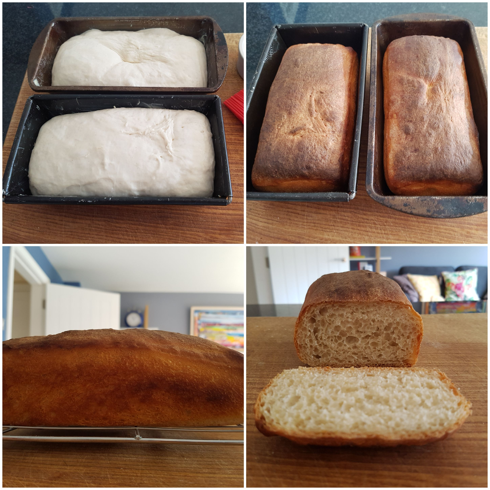

To me, white bread conjures up two specific treats: one is a deliciously soft bacon butty, with thick smoked back bacon and tomato ketchup; the other is a single slice, smeared with a thick layer of salted butter and a row of chip shop chips drenched in salt and vinegar. White bread is a treat and such a wonderfully moreish treat it is. Of course, you can buy perfectly good white bread from the supermarket but there is nothing better than freshly baked bread. So, for this post I will be reviewing recipes from four famous chefs: Paul Hollywood, Delia Smith, Dominic Chapman and Jamie Oliver; experimenting with ingredients to see the effects it has on the end result and defining my perfect white loaf based on my findings. So if you love white bread and want a recipe that explains what it is that makes it the best recipe, rather than just giving you a recipe then this is the place to come to. 

## Paul Hollywood's Basic White Tin Bread

First up is the dreamy-eyed Paul Hollywood and his basic white tin bread, which is found in his [How To Bake](https://www.amazon.co.uk/How-Bake-Paul-Hollywood/dp/140881949X/ref=sr_1_1_twi_har_2?ie=UTF8&qid=1527192202&sr=8-1&keywords=how+to+bake&dpID=51kRnw%252BT5xL&preST=_SX218_BO1,204,203,200_QL40_&dpSrc=srch) book. 

__NOTE:// Replace with the affiliate link here for Amazon__

In this book, Paul suggests using instant yeast as he believes there is little difference made to the quality of the bread when compared to using fresh yeast. However, he does stress that it is pivitol that you get the temperature of the water right for making your dough, which he suggests is 15ºC, which is fairly cool to the touch. 

> __Top Tip From Paul Hollywood__
>
> When adding water to yeast, colder water will produce slow-rising doughs, which have more flavour because as yeast feeds on flour it releases alcohol and this flavours the bread. Using warm water to activate the yeast will cause the bread to rise rapidly and have less flavour.

He also recommends using some unsalted butter to help the bread stay soft for longer, which may be important if you are making the bread for the week; and table salt to help flavour the bread and improve the gluten structure. The last ingredient he uses is olive oil for helping with kneading (which is not an issue for people with a stand mixer) and for greasing the loaf tin. 

He then leaves it to rise at 20-22ºC until it's doubled in size, which is roughly 1-2 hours. He does stress that the dough doubling in size is the key point here so don't take it out too soon. Once the dough has been knocked-back he then leaves the bread to prove in a loaf tin wrapped in a bag, for about an hour, until the dough is at least doubled in size and springs back quickly if prodded lightly. 

Finally, he slashes the top of the dough, dusts lightly with flour and bakes in the oven with a roasting tray filled with boiling water, to create a steamy atmosphere that will help give a crisp, light crust and slight sheen. 

### Verdict

The first thing to note about this bread was the look, it was relatively uniform which means the pockets of air have all risen equally, which makes a good loaf for making sandwiches from. When cutting into the bread the centre proved that point with small air pockets, this was due to the short gluten that had formed, most likely due to the butter in the dough. This also made the bread incredibly soft, which made it perfect for a fresh sandwich but interestingly not a packed lunch - I added tomatoes to my sandwich and even within the 10 minutes it took me to eat the sandwich, the tomato juice had already started to seep into the bread and make it slightly soggy, something that would not be appealing left in the fridge for lunch at work but freshly made is incredible. The last thing to say about this bread is how light and crispy the texture of the crust was, there was beautiful crunch without any toughness. Unfortunately, the bread was not entirely simple to get out of the loaf tin when cooked, luckily I had a silicon mat on the base so I could pry away the sides with a knife, but it wasn't as easy as I was hoping for. All in all, this loaf has definitely set the bar high for the other challengers in this post.

## Delia Smith's Easy White Loaf

Next up is the much loved Delia Smith, and her [Easy White Loaf](https://www.deliaonline.com/recipes/type-of-dish/bread-recipes/easy-white-loaf). For Delia's bread she doesn't use any fat - no butter and no oil, but instead uses hand-hot water with her yeast, something Paul doesn't agree with. She also mixes the yeast, salt and flour together before adding the water, which goes against Paul again, who separates his salt and yeast as the salt can stop the yeast from doing its job. Another difference, although how much difference this makes to the end result is still to be determined, is Delia has chosen butter as her grease for the tin instead of oil. 

However, the major difference I note with this recipe is the measurements Delia uses in comparison to Paul. She opts for more than 125% of flour in comparison to Paul's bread, but uses less than half the amount of yeast and almost triple the amount of salt! This seems to be at odds with the technical points that Paul has raised so it will be interesting to see the end result. As this is a larger loaf she cooks it for longer but interestingly starts her temperature higher and then brings it down for the final cooking stage. 

### Verdict

The taste of this bread was definitely more pronounced than with Paul's, which I attribute to the rather large amount of salt that Delia uses. It is also harder on the jaw than Paul's bread as there is more elasticity and therefore more chew, which will be down to not having any fat in the dough and therefore the gluten can stretch, a charactaristic of French bread (which I believe also doesn't have fat in). This in itself is not a criticism though as it makes for wonderfully delicious bread and butter when fresh and for very crisp toast when a day old. This bread works really well when toasted and then spread with butter and apricot jam, not sure why apricot, but it works better than all other jams! The crust was harder, which makes sense as there was no steam in the oven to soften it, and maybe also because of the longer gluten (but I'll have to test this theory), it was still good but not as good as Paul's, which was very light indeed. Finally, the loaf came out of the tin very easily, surprisingly easily compared to Paul's, it basically fell out! The difference between the two is the grease used to line the tin, in Paul's olive oil was used, but in Delia's unsalted butter was used. 

Out of the two so far, it is difficult to choose a clear winner as they both have such specific purposes. Paul's is the winner when it comes to making sandwiches and as it's softer, a favourite with my children, but Delia's is more like the wonderful French bread that I love so much, with more flavour and character, but doesn't last as long. Either way, I believe there is room for improvement and the one thing I can say for certain... use unsalted butter to grease your tin. 

## Dominic Chapman's White Bread

And now we have Dominic Chapman's [White Bread](https://www.greatbritishchefs.com/recipes/white-bread-recipe). Dominic uses a similar recipe to Delia but with half the salt, which should mean the yeast works better but the end result may not taste as good. He also splits the dough into two tins and cooks for a lot less time but at 250ºC, which is less faffy than Delia's. Finally, he brushes the dough with water before baking, which I'm sure will have some sort of effect on the crust, as he doesn't put steam into the oven.

### Verdict

As you can see this bread leaves much to be desired, which is such a shame as I had such high hopes for it due to it having less salt than Delia's and no butter. Firstly, from a health point-of-view this would be much better for you; but secondly, I was expecting a lovely crisp French-style loaf with long stretched gluten, due to the lack of butter and also the limited salt content (which has a retarding effect on the activity of the yeast), and instead I was left with a lump of bread that looked more like a meatloaf than a bread loaf! What I found most interesting about this bread is the formation of the air pockets in the loaf, if you compare them with the images from Paul and Delia's bread you will notice they are much larger, even though the bread hasn't risen as much. This definitely made a difference to the overall taste and texture of the bread, with the taste being the best out of the three breads so far and the texture being more like Delia's  but without the jaw-taxing elasticity. I would say this is the perfect bread for toasting and is the most similar to the traditional French baguette that I have made so far as it was incredibly crisp and light to eat, but it was not ideal for sandwiches. I'm now beginning to think there isn't a one-size-fits-all when it comes to bread. 

Another thing to note about this bread compared to the others is Dominic did not slash the top of his bread and the bread did not rise very well. It makes sense to me that if you cut into the stretched gluten just before popping in the oven, the air pockets underneath have more room to push up and therefore there is more scope for rising and, chiefly, stretching of the gluten whilst baking, which should lead to a lighter, crisper, more French-like loaf. However, this will need testing later. For now I'm happy to say if I can solve the issue with rising, then this would be my favoured bread for toasting so far, with Paul's being my favourite for sandwiches. 

## Jamie Oliver's Basic Bread Recipe

Finally, no post would be complete without a recipe from Mr Jamie Oliver, so here is his [Basic Bread Recipe](https://www.jamieoliver.com/recipes/bread-recipes/basic-bread-recipe/). 

Write up that Jamie uses sugar in his - isn't he supposed to be on a sugar tax mission now?

---
__This next section is for the experimentation still to be done__

## Different Wet Ingredients

Compare the use of water, milk and yoghurt in bread.

## Proving Time

Create a bread that is proved for 1 hour and compare it to a bread that is proved for 4 hours. Keep the temperature consistent.

## Proving Temperature

Create a bread that is proved at 27ºC (the supposed optimum temperature) until it is doubled in size and compare it to a bread that is proved at 5ºC in a fridge until it is doubled in size.

## Amount of Times the Dough is Proved

Create a bread that is proved just once, one that is proved twice and another that is proved 3 times. 

## Using Different Fats

Create a bread using olive oil, a bread using unsalted butter and a bread using duck fat.

## Using Water at Different Temperatures

This has already been done with Delia's recipe compared to Paul's so just write up the results. 

## Salt or No Salt?

Create a bread using salt and compare to one without salt.

## Different flours

Supposedly the flavour of the bread comes from the flour with the salt enhancing it. So try a different flour to Tesco, e.g. Hovis, Allison's, and some organic flour.

## Specialist ingredients

Use some of the E numbers and preservatives found in supermarket bread, e.g. 

- E481  : Sodium Stearoyl Lactate
- E472e : Diacetyltartaric acid esters of mono- and diglycerides (DATEM)
- E282  : Calcium Propionate
- Ascorbic Acid

Good website to find out about E numbers http://www.food-info.net/uk/e/e282.htm

## Slashing the top of the bread compared to not slashing the top of bread

Does this make a difference to the size of the air pockets during baking? I'm expecting that the by slashing the dough the loaf can rise more easily and the air pockets will be larger. 

---
__Everything below this needs reviewing__

- 400g Tesco strong white flour
- 8g table salt
- 7g Allison's Easy-Bake yeast
- 25g unsalted butter, softened
- 250ml warm water
- Olive oil, for proofing

### What I did

1. Warm the KitchenAid bowl with boiling water for a minute.
2. Pour away the water in the bowl and add the warm water and yeast. 
3. Stir with a whisk to dissolve the yeast. 
4. Put the bowl under the KitchenAid and add the dough hook. 
5. Pour the flour, salt and butter into the bowl. 
6. Turn the KitchenAid speed up to 2 and leave for 10 minutes.
7. Put some oil on your hand, take the dough off the hook and roll into a ball then put back into the KitchenAid bowl and clingfilm and leave to proof for 3 hours.
8. Put magic mat at the base of a loaf tin (what size?) and oiled the sides of the tin with olive oil.
9. Floured wooden chopping board, rolled dough out of bowl and knocked back gently.
10. Rolled into sausage shape and then put in the loaf tin with the seal at the bottom. 
11. Covered with clingfilm and left to proof again for 1 hour.
12. Pre-heat the oven to 220ºC and put a baking tray at the bottom to hold water. 
13. Slash the top lengthwise with a sharp knife (used a sharp pairing knife).
14. Boil some water and pour a full kettle of water into the tray.
15. Sprinkle over some flour and put in the oven for 30 mins.

### Notes

- Type of flour used was Tesco Strong White Bread Flour
- House temperature is 19.5ºC @ 8:00 rising to 20.5ºC @ 10:30
- Proofing from 8:00-11:00
- KitchenAid bowl was almost clean with a few remnants around the sides. 
- The dough was slightly sticky, where holding it for too long would require some effort in getting it off but would generally come off clean. It required realtively quick hands to stop it sticking a little olive oil helped to keep it from sticking. 
- The date is 11th May 2018, which may have an effect on end result (can check each month for variances in bread)
- The second proof started at 11:00 and the temperature in the house was 20.5ºC
- After the second proof the dough was still sticky to touch and was not springy as Paul had mentioned. 
- Scoring with a very sharp pairing knife just pulled the bread rather than cut. This could be because the dough was too wet but it could also be because I used a pairing knife when I should have used a sharp serrated knife like Paul said to use. 
- The oven took a whole 15 minutes to come up to 220ºC, which is worth bearing in mind.
- Dough wasn't appearing to rise much in the oven.
- The dough did not rise at all in the oven and the bread felt dense and when tapped there was a thud rather than a hollow sound. 
- The smell was lovely.
- The flavour of the bread was lovely, especially with butter but the texture was dense and the dough felt under cooked. 
- The crust was wonderful, very light and springy but also crisp. 

### Things to change for next time

#### Fermentation temperature

According to this website the optimum temperature for proving (sour dough) bread is 27ºC and Paul Hollywood expects proofing of this dough misture to be between 1-3 hours for it to double in size. After 3 hours it should have doubled - I don't think this has. Therefore, I can only surmise that that temperature for the fermentation was not high enough.

https://www.weekendbakery.com/posts/a-few-tips-on-dough-temperature/

So next time I should try preheating the oven to around 30ºC and then turning it off and putting the dough in the over to proof.

#### Sugar

I didn't put any sugar in this recipe because Paul Hollywood's 'Basic White Tin Bread' recipe does not have any in it. However, yeast feeds off sugar to release carbon dioxide, which helps the bread to rise so adding some in at the beginning will speed up the rising process. 

http://www.homemadeloaves.co.uk/2012/09/why-use-sugar-in-bread-dough.html

So another time I need to add sugar to see the difference. 

#### Fermentation time

Finally, it is possible to leave dough to rise in the fridge overnight and this can lead to a more sour bread

https://www.nigella.com/ask/proving-bread-overnight

## Take 2: Increasing the proving temperature

### Ingredients
- 400g Tesco Strong White Flour
- 7g Allison's Easy-Bake Yeast
- 8g table salt
- 250ml warm water
- 25g salted butter, softened

### Notes
- Dough went into oven at 31ºC
- Put dough into oiled metal bowl instead of using the KitchenAid bowl (mainly so that I can reuse the KitchenAid)
- Dough was slightly sticky again
- Put yeast into warm water in the KitchenAid bowl and dissolved before putting the other ingredients on top.
- After 1 hour the temperature was down to 27ºC but the bread was not doubled in size. 
- Rolled and put in tin, left for 2.5 hours, still not doubled in size. 
- Put in oven for 30 mins. 
- Bread similar to first attempt, hadn't risen, very dense, nice crust, flavour was good, threw in bin. 

## Take 3: Using cool water with the easy bake yeast

This time I put the yeast in as instructed by Paul Hollywood and the tin from Allison's Easy Bake Yeast. Turns out for easy-bake/fast-action/instant yeast you do not need to warm it up first. 

Everything else stayed the same. 

Unfortunately the end result was exactly the same as the other two. The bread didn't rise one iota and that made me sad. 

One weekend of baking down, 3 flat and ruined loafs, what have I learnt from this? I've made some changes to the technique for making bread and none of them have made a difference to the proving of the bread. Therefore there must be something in the ingredients that is stopping the bread from rising. Of course, yeast makes the bread rise so this is a good place to start. As I've already mentioned the right temperature for yeast to work is around 27ºC but changing the temp didn't work. We also know that salt plays a part in counteracting the yeast, but then I've been following a recipe by Paul Hollywood, who you would think knows his stuff so I doubt the salt is the problem. Finally, using the correct temperature to start the yeast off hasn't made a difference, when following the instructions on the tin or Paul Hollywood. So my only conclusion is there is something wrong with the yeast. 

### My realisation

I have suddenly had a realisation, the yeast that I was using was opened about a year ago and has been sat in my cupboard unused since then. I had a look on the tin and it says once opened use within 4 months. Now I am beginning to understand why my bread did not work at all. The yeast was dead. 

So, next weekend it will be a trip to the shops to buy some new yeast!

## Take 4: Using a freshly bought easy bake yeast

Added new yeast and the bread after the first proof was double in size after only an hour.
Temperature was around 27ºC for the entire time of the proof. 

The dough was incredibly light, soft and supple to touch and knock back. 
After the second proof the dough had doubled again and was ready to be baked.

I baked the bread at 230ºC for 30 minutes with a kettle of water bubbling away in the bottom of the oven to create a steamy environment so that the bread wouldn't crisp up too much.

The bread was super light for a sandwich, to the point where making a heavy tuna mayo and salad sandwich for lunch would cause the bread to collapse by 12 o'clock, wrapped in foil and plonked in a fridge. As a fresh sandwich it was delicious and soft, and as toast later in the day it was sublimely crispy and light, almost as perfect as Artisan for having butter and apricot jam on. 

The crust was too burnt and the curst was too crispy, need to figure out how to make a soft bread loaf (damp towel when it is resting maybe?). Wrapping the bread in a tea-towel to preserve seemed to help it with softening the crust. Even wrapping in a tea-towel kept the bread soft on the edges when toast was called for in the evening. 

# Take 5: Cutting the fat

Now that my bread is rising properly and I am actually baking edible bread, I can start changing the variables to understand what each component does to the shape, texture and flavour of the bread. So for this bread I am going to remove the fat, which in this case is the butter that I added. 

The bread didn't rise as much as the loaf with butter in but still doubled in size on the first proving. When the loaf was baked it appeared to cook quicker so I took it out 7 minutes before the final time of 30 minutes, but I think this may have been premature. The last one was sligtly burnt though so 30 minutes is too long and maybe 25 minutes is the right time. 

The bread was soft and airy, like a French baguette. It kept relatively well but to be honest it was gone within the day anyway. 

I preferred the non-butter bread as it reminds me of the bread in France and they know how to make bread. 
